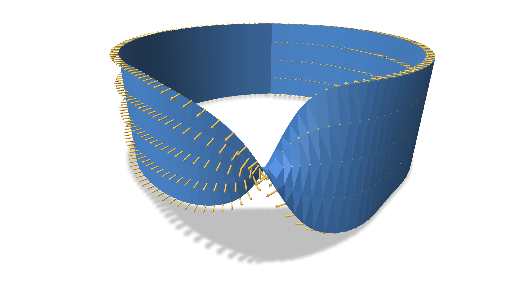
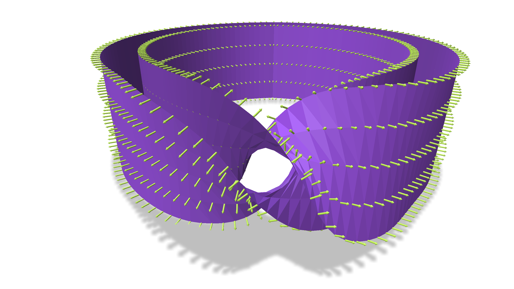

# Computing Orientable Double Covers

Any surface---whether orientable or not---has an [orientable double cover](https://en.wikipedia.org/wiki/Orientability#Orientable_double_cover).




On triangle meshes, this double cover has a simple construction. You take each triangle in the input mesh and make two copies, assigning the two copies opposite orientations. Then you glue together the copies of adjacent triangles whose orientations agree.

To build the code, you can run
```
cd build
make -j7
```

Then run the code with
```
bin/run /path/to/a/mesh
```
